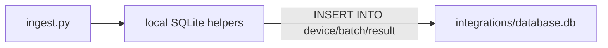

# Align local SQLite with shared `database.db`

## Problem

[`config.json`](config.json) correctly points at `"database": "../database.db"`. That shared DB (managed by oxpecker) has:

```sql
device (id INTEGER PRIMARY KEY, ..., company_id TEXT NOT NULL DEFAULT 'default')
batch  (id INTEGER PRIMARY KEY, date TEXT, name TEXT, ..., company_id ...)
result (id INTEGER PRIMARY KEY, ..., batch_id INTEGER, device_id INTEGER)
```

Spectrometer still inserts **UUID strings** into PascalCase `Device` / `Batch` / `Result`, which causes `sqlite3.IntegrityError: datatype mismatch`.

## Approach

Rewrite local SQLite helpers to match oxpecker’s insert style (see [`oxpecker/src/lib/database.ts`](../oxpecker/src/lib/database.ts)): omit `id`, use lowercase table names, store ISO batch dates, set `company_id`.

Keep Supabase paths unchanged.



## Code changes

### 1. [`src/device.py`](src/device.py)

- `find_device_local`: query `device` (lowercase), filter by `identifier` **and** `company_id`.
- `create_device_local`:
  - Accept `company_id` (default `"default"`).
  - `INSERT INTO device (name, identifier, place, category, connection_details, company_id)` — **no `id`**.
  - Return `{"id": cur.lastrowid, ...}` (integer).
- `ensure_device_table`: create oxpecker-compatible DDL if missing:

```sql
CREATE TABLE IF NOT EXISTS device (
  id INTEGER PRIMARY KEY,
  created_at TEXT DEFAULT (datetime('now')),
  name TEXT NOT NULL,
  place TEXT,
  category TEXT,
  connection_details TEXT NOT NULL,
  identifier TEXT NOT NULL,
  company_id TEXT NOT NULL DEFAULT 'default'
);
```

- `find_or_create_device` local branch: resolve local company as `config online_sync.company_id` or `"default"`, pass it through.
- Remove unused `uuid` import if no longer needed here.

### 2. [`src/db.py`](src/db.py)

- `_ensure_tables_local`: create oxpecker-compatible `batch` / `result` (INTEGER PKs, `company_id` on batch, integer FKs). Do not create the old TEXT/UUID schema.
- `find_or_create_batch_local`:
  - Convert date with existing `_date_to_iso_date` (ISO `YYYY-MM-DD`, same as oxpecker/`safeIsoDate`).
  - Lookup/insert by `(name, date, company_id)`.
  - Omit `id`; use `lastrowid`.
- `has_results_for_device_datetime_local` / `insert_results_local`:
  - Use table `result`, integer `device_id` / `batch_id`.
  - Omit `id` on insert: `INSERT INTO result ("key", value, datetime, obs, batch_id, device_id)`.
- Thread `company_id` into local batch helpers (default `"default"`).
- Drop `uuid` usage for local inserts.

### 3. [`src/ingest.py`](src/ingest.py)

- When using local DB, pass the same local `company_id` (`online_sync.company_id` or `"default"`) into batch create/find.

### 4. Config / docs / tests

- Keep [`config.json`](config.json) as `"../database.db"` (already correct).
- Update [`config.example.json`](config.example.json) and [`tests/test_config.json`](tests/test_config.json) to use `"../database.db"` so examples match shared-DB intent.
- Update [`README.md`](README.md): local SQLite must match oxpecker schema; prefer shared `../database.db`.
- Adjust any tests that assume UUID string IDs for local inserts (e.g. [`tests/test_company_id.py`](tests/test_company_id.py) if affected). Add a small unit test that local device insert omits `id` / uses integer `lastrowid` against a temp DB created with the oxpecker DDL.

### 5. Verify

```bash
.venv/bin/python src/main.py --once
```

Expect: device created/found in shared `device` table, results inserted without `datatype mismatch`.

## Out of scope

- Migrating/deleting the old local `spectrometer.db` UUID data (unused once config points at shared DB).
- Changing Supabase remote schema.
- Fixing ownership of `database.db` (already fixed via `chown`).
