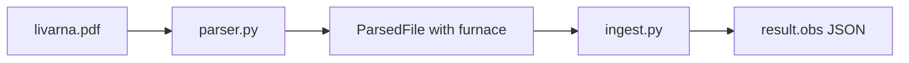

# Parse Peč info from livarna.pdf

## Problem

[`tests/livarna.pdf`](tests/livarna.pdf) contains furnace info at the top:

```
Peč 2
...
Peč:
Material:
EN-GJMW 400-05
```

The parser already extracts batch (`131`), material, date/time, and chemistry, but **Peč is ignored**. [`ParsedFile`](src/parser.py) has no `furnace` field, and [`ingest.py`](src/ingest.py) inserts all results with `obs: None`, so furnace data is never stored.

Oxpecker expects furnace in `result.obs` JSON (see [`oxpecker/src/lib/database.ts`](../oxpecker/src/lib/database.ts)):

```json
{"fusion":"131","material":"EN-GJMW 400-05","furnace":"2","date":"09/03/2026","hour":"10:48:44"}
```

## Approach



## Code changes

### 1. [`src/parser.py`](src/parser.py)

- Add optional `furnace: str | None = None` to `ParsedFile`.
- Add `_extract_furnace(text: str) -> str | None`:
  - **Title line:** `Peč 2` → `r"(?i)^\s*Peč\s+(\S+)"` on first non-empty lines.
  - **Label line:** `Peč: 2` on same line → `r"(?i)Peč\s*:\s*(\S+)"`.
  - **Next-line label:** if line is `Peč:` only, read first token from next non-empty line (same pattern used for `Št. šarže`).
  - Normalize to stripped string (e.g. `"2"`).
- Call `_extract_furnace` from `_parse_pdf_format` and `_parse_txt_format` (return `None` when absent; giorgietti PDFs unaffected).
- Wire into `ParsedFile(..., furnace=furnace)`.

### 2. [`src/ingest.py`](src/ingest.py)

- Add helper `_build_result_obs(parsed: ParsedFile) -> str` that JSON-serializes oxpecker-compatible metadata:

```python
{
  "fusion": parsed.batch,
  "material": parsed.material,
  "furnace": parsed.furnace or "",
  "date": parsed.date,
  "hour": parsed.time,
}
```

- Replace `obs: None` with this JSON for every chemistry row inserted (local + Supabase paths).

### 3. Tests and fixtures

- Update [`tests/expected_assets.json`](tests/expected_assets.json):
  - `livarna.pdf`: add `"furnace": "2"`
  - `giorgietti.pdf`: add `"furnace": null` (or omit; test treats missing as None)
- Extend [`tests/test_files.py`](tests/test_files.py) to assert `parsed.furnace == expected.get("furnace")`.
- Add focused unit test in [`tests/test_parser_io.py`](tests/test_parser_io.py) or new `tests/test_furnace_extraction.py` for `_extract_furnace` with inline sample text from livarna layout.

### 4. Verify

```bash
.venv/bin/python -m pytest tests/test_files.py -q
.venv/bin/python -c "from pathlib import Path; import sys; sys.path.insert(0,'src'); from parser import parse_file; p=parse_file(Path('tests/livarna.pdf')); print(p.furnace)"
```

Expected output: `2`.

Re-ingest livarna.pdf and confirm shared DB rows have `obs` containing `"furnace":"2"`.

## Out of scope

- Creating separate `device` rows per Peč (still uses config `identifier`).
- WebSocket payload changes (still fusion + material only).
- Italian giorgietti PDF furnace extraction (no Peč field in that format).
