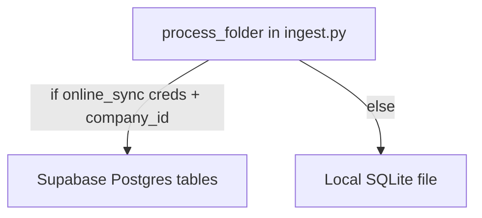

# Schema alignment and SQLite startup fix

## 1. Is the app using the Supabase schema?

**Partially — same domain model, two backends, not one shared schema.**

This integration supports **either** Supabase (cloud) **or** local SQLite (offline fallback). It does **not** run Supabase migrations or read a shared schema file from elsewhere in the repo.



### Supabase tables used (assumed to already exist)

| Table | Used in | Key columns written/read |
|---|---|---|
| `company_user` | [`src/device.py`](src/device.py) | `company_id` (lookup only) |
| `device` | [`src/device.py`](src/device.py) | `name`, `place`, `category`, `identifier`, `connection_details`, `company_id` |
| `batch` | [`src/db.py`](src/db.py) | `name`, `date` (ISO `YYYY-MM-DD`), `company_id` |
| `result` | [`src/db.py`](src/db.py) | `key`, `value`, `datetime`, `obs`, `batch_id`, `device_id` |

### Local SQLite tables created on startup

Defined inline in code (no `.sql` migrations in this repo):

- [`ensure_device_table`](src/device.py) → `Device`
- [`_ensure_tables_local`](src/db.py) → `Batch`, `Result`

Existing local schema in [`spectrometer.db`](spectrometer.db) matches those `CREATE TABLE IF NOT EXISTS` statements.

### Important differences (not 1:1 with Supabase)

| Aspect | Supabase | Local SQLite |
|---|---|---|
| Table names | lowercase (`device`, `batch`, `result`) | PascalCase (`Device`, `Batch`, `Result`) |
| IDs | treated as integers in Supabase helpers (`device_id: int`, `batch_id: int`) | UUID strings generated in Python |
| `company_id` | required on `device` / `batch` | **not stored locally** |
| `connection_details` | JSON object | JSON **string** (`TEXT`) |
| `date` on batch | converted to ISO `YYYY-MM-DD` | stored as parser string `DD/MM/YYYY` |
| `product_id` | not written to Supabase | column exists locally but stays `NULL` |

**Conclusion:** the app is designed to write the **same logical data** (device, batch, results) to both stores, but the local SQLite schema is a **simplified offline mirror**, not a copy of the Supabase/Postgres DDL.

### Runtime behavior today

From [`src/ingest.py`](src/ingest.py):

1. Try Supabase if `online_sync` URL/key + email/password are set and `company_id` resolves.
2. Otherwise fall back to local SQLite at `config["database"]` (your [`config.json`](config.json) points to `../database.db`).
3. Supabase and local are **not dual-written** in one run — it picks one path per execution.

Your current [`config.json`](config.json) has **no `online_sync` block**, so this run would be **local-only** once Python starts.

---

## 2. Why `python src/main.py` crashes

The traceback is an **environment issue**, not an app/schema bug:

```
ImportError: ... Symbol not found: _sqlite3_deserialize
Expected in: /opt/miniconda3/lib/libsqlite3.0.dylib
```

- `.venv` was created from **Conda Python 3.12** (`/opt/miniconda3`).
- Conda’s `libsqlite3.0.dylib` is older than the `_sqlite3` extension Python expects.
- `/usr/local/bin/python3` **can** import `sqlite3` successfully on your machine; the broken venv cannot.

This happens before any DB logic runs — at `import sqlite3` in [`src/device.py`](src/device.py) line 3.

---

## 3. Fix plan (environment)

**Recommended: recreate the venv with Homebrew/system Python** (avoids Conda sqlite mismatch).

From the project root [`integrations/spectrometer`](integrations/spectrometer):

```bash
deactivate 2>/dev/null || true
rm -rf .venv
/usr/local/bin/python3 -m venv .venv
source .venv/bin/activate
python -c "import sqlite3; print('sqlite ok', sqlite3.sqlite_version)"
pip install -r requirements.txt
python src/main.py --once
```

**Verify interpreter path** after activation:

```bash
which python
python -c "import sys; print(sys.executable)"
```

Expected: paths under `.venv/`, **not** `/opt/miniconda3/...`.

### Alternative (keep Conda base Python)

If you prefer Conda as the interpreter, align sqlite in base:

```bash
conda install -c conda-forge sqlite
# or: conda update python sqlite
```

Then recreate `.venv` from that fixed Conda Python and reinstall requirements.

### Optional hardening (only if you want fewer future env surprises)

- Add a short note to project docs: “create venv with `/usr/local/bin/python3`, not Conda base”.
- Add a startup check in [`src/main.py`](src/main.py) that catches `ImportError` for `sqlite3` and prints the recreate-venv instructions (code change; optional).

---

## 4. What success looks like

After the venv fix:

```bash
python src/main.py --once
```

Should print something like:

- `Connected to local database: ...`
- `Device: ... | identifier: ...`
- `Processed N file(s)`

No Supabase message unless you add `online_sync` credentials to config or `.env`.

---

## 5. Out of scope (unless you want follow-up)

- Aligning local SQLite schema 1:1 with Supabase (add `company_id`, integer IDs, lowercase names).
- Adding Supabase migration/SQL files to this repo.
- Dual-writing to both Supabase and SQLite in the same run.
