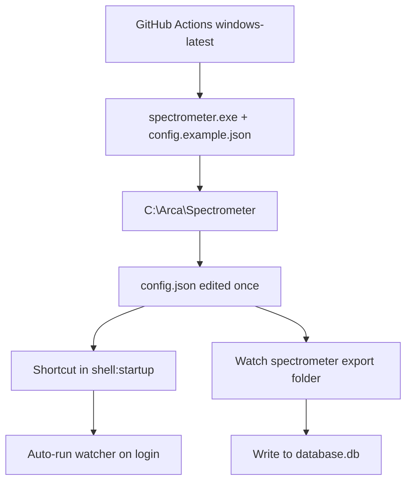

# Windows deployment, exe build, and boot startup

## Current state

The app is already **exe-ready** in code:

- [`src/config.py`](src/config.py): when frozen (`sys.frozen`), `get_app_dir()` = folder containing `spectrometer.exe`; missing `config.json` is auto-created from bundled `config.example.json`.
- [`src/main.py`](src/main.py): default mode runs the **continuous watcher** (no `--once`) — correct for production.
- [`packaging/WINDOWS_README.txt`](packaging/WINDOWS_README.txt): manual install + Startup-folder instructions exist, but there is **no PyInstaller spec or CI workflow yet**.



## Part 1 — Initialize on a machine (operator steps)

### Development (macOS/Linux today)

Already documented in [`README.md`](README.md):

```bash
/usr/local/bin/python3 -m venv .venv
source .venv/bin/activate
pip install -r requirements.txt
cp config.example.json config.json   # edit paths
python src/main.py --once              # validate
python src/main.py                     # run watcher
```

### Production Windows (after exe is built)

1. Create install folder, e.g. `C:\Arca\Spectrometer` (or `%LOCALAPPDATA%\Spectrometer`).
2. Copy from release zip:
   - `spectrometer.exe`
   - `config.example.json` (bundled inside exe, but ship alongside for reference)
3. First run creates `config.json` next to the exe if missing.
4. Edit `config.json` once:

| Key | Windows example | Notes |
|---|---|---|
| `folder` | `C:\Spectrometer\Export` | Folder where the instrument drops PDF/TXT files |
| `database` | `C:\Arca\database.db` | Use **absolute path** for shared oxpecker DB (avoid `../database.db` unless parent layout is guaranteed) |
| `identifier` | `LABORATORIO` | Stable device id |
| `device.name` / `place` | lab metadata | shown in DB |
| `websocket` | optional Oxpecker URL | if used |
| `online_sync` | optional Supabase creds | omit for local-only |

5. Run once manually: double-click `spectrometer.exe` or `spectrometer.exe --once` — confirm console shows DB + device + processed files.
6. Enable boot startup (Part 3).

## Part 2 — Build workflow for Windows `.exe`

Add PyInstaller packaging under [`packaging/`](packaging/).

### Files to add

1. **`packaging/spectrometer.spec`**
   - Entry point: [`src/main.py`](src/main.py)
   - `pathex=['src']` so imports resolve
   - Bundle data: `config.example.json` → copied into `_MEIPASS` (required by `_frozen_template_path()`)
   - Mode: **`onedir`** (recommended for long-running `watchdog` watcher; more reliable than onefile)
   - Output: `dist/Spectrometer/spectrometer.exe`
   - Hidden imports: `pypdf`, `watchdog`, `websockets`, `supabase`, `httpx`, etc. (add as needed after first build test)

2. **`packaging/build_windows.ps1`**
   ```powershell
   python -m venv .venv-build
   .\.venv-build\Scripts\pip install -r requirements.txt pyinstaller
   pyinstaller packaging/spectrometer.spec --noconfirm
   ```
   Produces `dist/Spectrometer/` folder to zip and ship.

3. **`.github/workflows/build-windows.yml`**
   - Trigger: `workflow_dispatch` + tags `v*`
   - Runner: `windows-latest`
   - Steps: checkout → setup Python 3.12 → `pip install -r requirements.txt pyinstaller` → `pyinstaller packaging/spectrometer.spec` → upload `dist/Spectrometer` as artifact / attach to GitHub Release

4. **Update [`requirements.txt`](requirements.txt)** or add `requirements-build.txt` with `pyinstaller` (build-only, not runtime on target machines).

5. **Update [`packaging/WINDOWS_README.txt`](packaging/WINDOWS_README.txt)** and [`README.md`](README.md)** with build + install steps.

### Build verification (on Windows)

```powershell
dist\Spectrometer\spectrometer.exe --once
```

Confirm: config auto-created, folder scan works, SQLite writes succeed.

## Part 3 — Auto-start on machine boot

**Chosen approach: Windows Startup folder shortcut** (matches existing docs; runs in user session with access to network folders and SQLite).

### Manual (operator)

1. `Win+R` → `shell:startup`
2. Create shortcut → target: `C:\Arca\Spectrometer\spectrometer.exe`
3. Optional: set shortcut **Start in** to exe folder
4. Reboot / sign out-in → watcher should start automatically

### Automated (recommended addition)

Add **`packaging/install_windows.ps1`**:

- Args: `-InstallDir`, `-SpectrometerFolder`, `-DatabasePath`
- Copies/build artifacts into install dir
- Writes/edits `config.json` with those paths
- Creates Startup shortcut via WScript.Shell
- Prints success + paths to verify

Example:

```powershell
.\packaging\install_windows.ps1 `
  -InstallDir "C:\Arca\Spectrometer" `
  -SpectrometerFolder "C:\Spectrometer\Export" `
  -DatabasePath "C:\Arca\database.db"
```

### Not in scope (unless requested later)

- Windows Service (needs extra wrapper, harder to debug)
- Task Scheduler at system boot before login (usually unnecessary; spectrometer export is user/LAN accessible at login)

## Part 4 — Small code hardening (optional but useful)

- [`config.example.json`](config.example.json): change Windows-oriented defaults in comments or use `database.db` (same folder as exe) as fallback when shared DB is not used.
- [`src/main.py`](src/main.py): on frozen runs, print install dir + config path on startup so operators can diagnose missing folder/DB quickly.

## Deliverables checklist

| Item | Purpose |
|---|---|
| `packaging/spectrometer.spec` | PyInstaller build definition |
| `packaging/build_windows.ps1` | Local Windows build script |
| `packaging/install_windows.ps1` | One-shot machine init + Startup shortcut |
| `.github/workflows/build-windows.yml` | CI artifact / release exe |
| Updated README + WINDOWS_README | Operator + developer docs |

## Success criteria

1. GitHub Actions produces a downloadable Windows zip with `spectrometer.exe`.
2. Fresh Windows machine: run install script → edit nothing else if paths passed → exe watches folder and writes to `database.db`.
3. After reboot, watcher starts automatically without manual launch.
